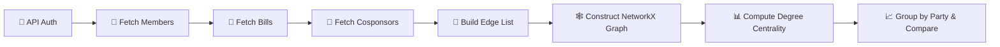

# 🏛️ Congressional Cosponsorship Network Analysis

### Degree Centrality Comparison Across Party Affiliation in the U.S. Congress

[](https://www.python.org/)
[](https://networkx.org/)
[](https://api.congress.gov/)
[](LICENSE)

---

## 📌 Project Overview

This project presents a **high-level analysis plan** for building and analyzing a **bill cosponsorship network** from the United States Congress. Using data acquired through the **Congress.gov API** (Library of Congress), the plan describes how to construct a network where legislators are connected by shared cosponsorship of legislation — and then compare **degree centrality** across categorical groups, primarily **party affiliation** (Democrat, Republican, Independent).

> **🎯 Central Research Question:** *Does a legislator's party affiliation predict how broadly they collaborate with colleagues through bill cosponsorship?*

---

## 🔗 Network Definition

| Element | Description |
|:---|:---|
| 🟢 **Nodes** | Members of Congress (~535 legislators per session) |
| 🔵 **Edges** | Cosponsorship ties — two legislators share an edge if they cosponsored the same bill |
| ⚖️ **Edge Weight** | Number of bills cosponsored together (stronger weight = deeper collaboration) |
| 📊 **Degree Centrality** | Fraction of all other legislators a given member is directly connected to |

---

## 📂 Repository Contents

```
📁 congressional-cosponsorship-network/
│
├── 📄 Congressional_Cosponsorship_Network_Analysis_Plan.docx
│       └── Full project plan document (data source, loading steps,
│           network definition, hypothetical outcomes)
│
├── 📄 Video_Presentation_Script.docx
│       └── Narrated walkthrough script for video presentation
│
├── 📄 README.md
│       └── This file
│
└── 📁 code/ (future)
        └── Jupyter notebooks and Python scripts for implementation
```

---

## 🌐 Data Source

**[Congress.gov API](https://api.congress.gov/)** — maintained by the Library of Congress

| Detail | Info |
|:---|:---|
| 🔑 **Authentication** | Free API key from [api.data.gov](https://api.data.gov/) |
| ⚡ **Rate Limit** | 5,000 requests/hour |
| 📦 **Format** | JSON responses with pagination support |
| 📅 **Coverage** | Bill and member data from the 81st Congress (1949) to present |

### Key Endpoints Used

| Endpoint | Purpose |
|:---|:---|
| `GET /v3/member` | Retrieve all legislators with party, state, and chamber |
| `GET /v3/bill/{congress}/{type}` | Retrieve all bills for a Congressional session |
| `GET /v3/bill/{congress}/{type}/{number}/cosponsors` | Get cosponsor list for each bill |

---

## 🏷️ Categorical Variables

The primary grouping variable for degree centrality comparison:

| Variable | Categories | Why It Matters |
|:---|:---|:---|
| 🟥🟦 **Party** *(primary)* | Democrat · Republican · Independent | Does one party collaborate more broadly? |
| 🏛️ **Chamber** | Senate · House | Does chamber structure affect connectivity? |
| 🗺️ **Region** | Northeast · South · Midwest · West | Are regional caucuses more insular? |
| 📍 **State** | 50 states + territories | Do large delegations cluster together? |

---

## 🔬 Hypothetical Outcomes

The plan describes **five predicted outcomes** from comparing degree centrality across party groups:

### 🔮 Outcome A — Minority Party Shows Higher Centrality
> The minority party must build cross-aisle coalitions to advance legislation, forcing broader cosponsorship networks and inflating degree centrality.

### 🔮 Outcome B — Independents as Extreme Outlier Bridges
> The 2–3 Independent legislators show dramatically high centrality because they cosponsor freely across both parties, acting as structural bridges.

### 🔮 Outcome C — Chamber Matters More Than Party
> Senate vs. House differences dominate party differences — the filibuster's 60-vote threshold forces Senators into broader collaboration patterns.

### 🔮 Outcome D — Bimodal Distribution in the Majority Party
> A leadership-backbencher divide emerges: committee chairs and party leaders have very high centrality while rank-and-file members cluster low.

### 🔮 Outcome E — Swing-State Legislators Collaborate More Broadly
> Electoral pressure drives collaboration — legislators from competitive states cosponsor more broadly to demonstrate bipartisan appeal to voters.

---

## 🛠️ Technology Stack

| Tool | Role |
|:---|:---|
| 🐍 **Python 3.10+** | Primary language |
| 🌐 **requests** | API calls with authentication and pagination |
| 🕸️ **NetworkX 3.x** | Graph construction and centrality computation |
| 🐼 **pandas** | Data wrangling and group aggregation |
| 📊 **scipy / scikit-posthocs** | Kruskal-Wallis, Dunn's post-hoc, Mann-Whitney U |
| 🎨 **matplotlib / seaborn** | Visualization (box plots, violin plots, network graphs) |

---

## 📋 Data Loading Pipeline (High Level)



**Step-by-step:**

1. **Environment Setup** — Install `requests`, `networkx`, `pandas`, `scipy`, `seaborn`
2. **Fetch Members** — Pull ~535 legislators with party, state, chamber from `/v3/member`
3. **Fetch Bills & Cosponsors** — For each bill, retrieve the full cosponsor list
4. **Build Edge List** — Generate pairwise combinations from each bill's collaboration group
5. **Construct Graph** — Load into NetworkX with party as a node attribute
6. **Compute Centrality** — `nx.degree_centrality(G)` → group by party → compare
7. **Statistical Testing** — Kruskal-Wallis across parties, Dunn's post-hoc for pairwise
8. **Cache Locally** — Save graph as `.graphml`, DataFrames as `.csv`

---

## 👩🏽‍💻 Author

**Candace Grant**
M.S. Data Science — CUNY School of Professional Studies

---

## 📄 License

This project is submitted as coursework for the CUNY SPS Data Science program. The data is sourced from the public domain [Congress.gov API](https://api.congress.gov/).

---

<p align="center">
  <i>Built with 🐍 Python · 🕸️ NetworkX · 🏛️ Congress.gov API</i>
</p>
